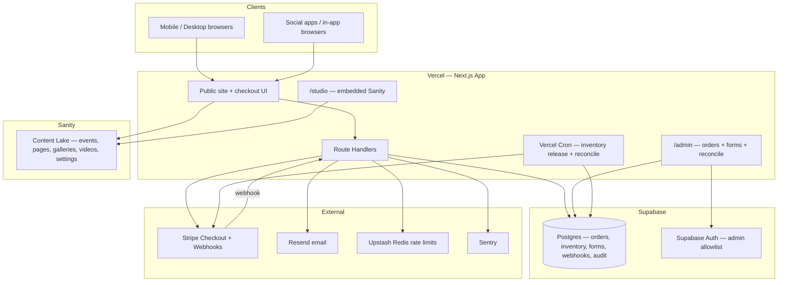
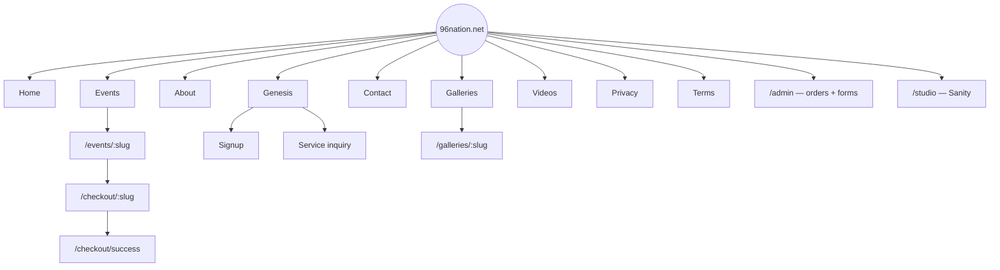
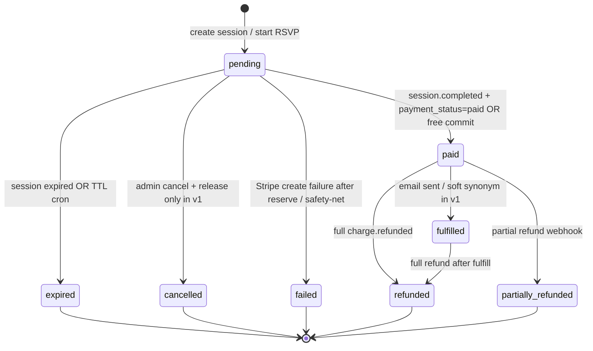
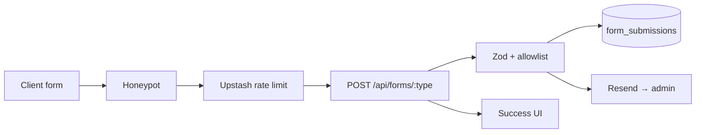
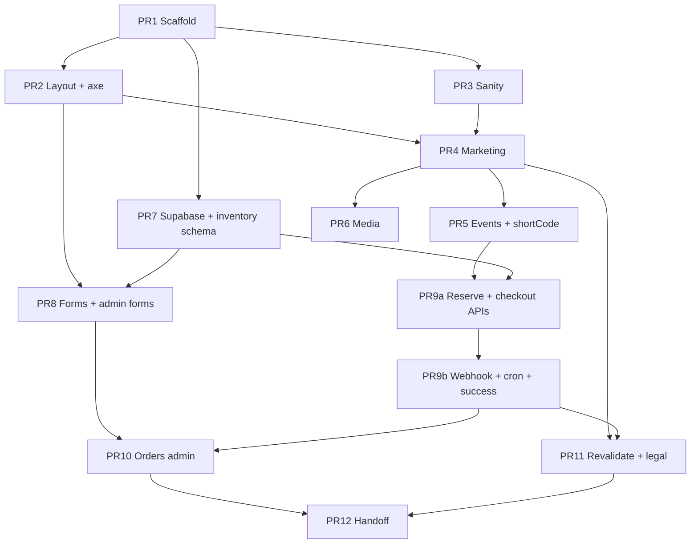

# Design Document: 96nation.net Ticketing Hub Revamp

| Field | Value |
|-------|--------|
| **Title** | 96nation.net Ticketing Hub — System Design |
| **Author** | Engineering (TBD) |
| **Date** | 2026-08-06 |
| **Status** | Draft (Revised) |
| **Revision** | 2026-08-06r3 — owner decisions: facility fee $1 default, buyer-only PII, no tax, AA placeholders, preview DNS |
| **Workspace** | `C:\Users\test\Documents\96-nation-site` |
| **Target domain** | `https://96nation.net` (prefer HTTPS; DNS currently unresolved) |

---

## Overview

96 Nation needs `96nation.net` rebuilt from a near-empty Create React App shell into a **mobile-first ticketing hub**: shareable deep links from Instagram/Facebook/TikTok, a checkout that collects **name, phone, and email**, reliable payments, and an admin experience a non-technical owner can use for events, copy, galleries, and videos. Parallel to ticketing, the site hosts **96 Nation: Genesis** forms (signups, service inquiries, contact).

This design migrates the greenfield CRA app (`96-nation/`) to **Next.js App Router on Vercel**, uses **Sanity** as the content CMS, **Supabase Postgres** for **orders (buyer PII + quantity), form submissions, and authoritative inventory**, **Stripe Checkout** for paid tickets (PCI-minimal), and **Resend** for confirmation and admin notification emails. Door lists expand from order quantity at CSV export (no separate attendees table in v1). Inventory is **reserved at checkout-session create** (not only after payment), with TTL release and webhook idempotency that survives mid-handler failure. Free/RSVP events are a designed v1 path that skips Stripe but still collects PII and consumes capacity atomically.

---

## Background & Motivation

### Current state

| Area | State |
|------|--------|
| App | CRA (`react-scripts` 5.0.1) under `96-nation/` |
| UI | Default boilerplate (`src/App.js` logo spin + “Learn React”) |
| Styling | Tailwind CSS ^4.1.2 in `devDependencies` but **not wired** (no `tailwind.config.*`, no PostCSS app config, no `@import "tailwindcss"` / utilities in `src/index.css` or `App.css`) |
| Routing | None |
| Backend / CMS / auth / payments | None |
| Domain | `96nation.net` DNS fetch fails (unregistered, expired, or not pointed) |
| Brand context | Tallahassee-area music / local talent; Instagram-driven all-ages shows (historically ~$7 tickets) |
| Repo hygiene | Workspace root and `96-nation/` both have stock CRA README — replace with real project README in PR 1/12 |

### Pain points this design addresses

1. **No product surface** — cannot sell tickets or collect attendee PII today.
2. **Social traffic needs deep links + OG previews** — CRA SPA alone is weak for share cards and crawlers without extra infrastructure.
3. **Owner cannot self-serve content** — no CMS for events, galleries, or videos.
4. **CRA is aging** — no first-class API routes, image optimization, or metadata API; Tailwind 4 wiring on CRA is awkward compared to Next.js.
5. **Handoff risk** — empty shell + placeholder README leaves no runbooks, env map, or admin guide.

### Expected scale (planning assumptions)

- Local / regional events: **dozens to low thousands** of tickets per event, not stadium scale.
- Concurrent checkout: **low tens** of simultaneous buyers at on-sale spikes.
- Admin users: **1–3** initially (single owner + optional helper).
- Media: photo galleries and short promo videos (not a full VOD platform).

### Scalability note (capacity planning)

At the stated scale, **no sharding or multi-region DB** is required. Bottlenecks:

| Component | Behavior at scale |
|-----------|-------------------|
| Event pages | Cache via Next `revalidateTag` / ISR; Sanity reads are not on the hot payment path after inventory is mirrored to Postgres |
| Payment | Stripe scales independently; our work is session create + webhook |
| Inventory | **One hot row per `(event_id, ticket_type_id)`** with row-level lock on reserve/commit/release — acceptable for low-tens concurrent checkouts |
| Serverless cold starts | Occasional +100–300ms on first checkout after idle; not material for local-event traffic |
| Email | Resend async; do not block webhook response on email failure (outbox pattern) |

---

## Goals & Non-Goals

### Goals

1. Public **event list + event detail** pages with stable, shareable URLs.
2. **Ticket purchase flow** collecting name, phone, email; paid via Stripe **or free RSVP**; confirmation email; admin visibility of **orders (buyer PII + quantity)** and door CSV export.
3. **Non-technical admin**: edit site copy/pages, CRUD events, manage galleries, embed videos; unified ops admin for orders + forms.
4. **Genesis forms**: signup, service inquiry, contact — stored + email notification.
5. **WCAG 2.2 AA** target and **mobile-first** layouts for social-origin traffic.
6. **Handoff package**: README, env docs, admin guide, credentials map, costs, deploy/rollback runbooks.
7. Deploy to production on **Vercel** with HTTPS and custom domain once DNS is ready.
8. **Hard inventory reservation** so concurrent on-sales do not charge-then-refund as the primary control.

### Non-goals (v1)

- Multi-vendor marketplace or promoter white-label.
- Seat maps / reserved seating / barcode scanners at door (door list export is enough for v1).
- Native mobile apps.
- Complex CRM / marketing automation beyond basic attendee export and optional email list consent.
- Full custom blog/news CMS beyond a simple “News” or “Updates” content type if needed.
- Multi-currency or international tax engines (US USD only in v1).
- Building a custom payment processor or storing card data.
- Multi-type shopping cart (one ticket type per checkout session).
- Waitlists, promo codes (v1.1), SMS confirmations.
- Sanity-hosted large video file uploads as primary (YouTube/Vimeo embed default).

---

## Proposed Design

### Architecture recommendation (concrete stack)

| Layer | Choice | Rationale |
|-------|--------|-----------|
| Framework | **Next.js 15 (App Router) + TypeScript** | SSR/SSG, Metadata/OG API, Route Handlers for Stripe webhooks, Image optimization, Vercel-native |
| Styling | **Tailwind CSS v4** | Utility-first, mobile-first; install via official Next + Tailwind v4 recipe (not CRA leftovers) |
| Hosting | **Vercel** | Zero-ops deploys, preview URLs, edge CDN, MCP tooling available |
| Content CMS | **Sanity** — **embedded Studio at `/studio`** | Single deploy URL for owner training; Sanity login; Content Lake for pages/events/media metadata |
| Transactional DB | **Supabase Postgres** | Orders, inventory (SoT), forms, webhook events, audit log; RLS; SQL export |
| Auth (ops admin) | **Supabase Auth** magic link + `ADMIN_EMAILS` allowlist | Gates `/admin/*` for orders, forms, reconcile, export |
| Payments | **Stripe Checkout** (hosted) | PCI SAQ A; mobile-friendly; webhook-driven fulfillment |
| Email | **Resend** (+ React Email templates) | Transactional confirmations + form alerts; domain SPF/DKIM in Phase 0 |
| Rate limit | **Upstash Redis** (`@upstash/ratelimit`) | Serverless-safe limits on forms + checkout session create |
| Media | **Sanity images** + **YouTube/Vimeo embeds** (default for video) | Avoid large video quota on CMS free tier |
| Errors / alerts | **Sentry** (required for live ticketing) | Webhook 5xx, reconcile backlog, unhandled exceptions |
| Analytics | **Vercel Analytics** + optional Plausible/GA4 | Privacy-conscious default |
| Short / deep links | `/events/[slug]`, `/t/[code]` from Sanity `event.shortCode` | Social bio and story stickers |

**Migrate off CRA.** Keeping CRA would force a separate backend for webhooks, poor OG control, and awkward Tailwind 4 wiring. The app is still boilerplate — migration cost is low and front-loaded.



### Repository layout (target)

**Replace `96-nation/` CRA tree with Next.js app** (delete `src/`, CRA `public/index.html` SPA shell; keep app name).

```text
96-nation/
  app/
    (marketing)/
    events/
      page.tsx
      [slug]/page.tsx
    checkout/
      [eventSlug]/page.tsx
      success/page.tsx
      cancel/page.tsx
    t/[code]/route.ts
    api/
      stripe/webhook/route.ts
      forms/[type]/route.ts
      checkout/session/route.ts
      checkout/rsvp/route.ts
      inventory/sync/route.ts      # Sanity → Postgres capacity sync (server + secret)
      revalidate/route.ts
      health/route.ts
      cron/release-reservations/route.ts
      cron/reconcile-orders/route.ts
    admin/
      layout.tsx                   # auth gate
      orders/
      forms/
      login/
    studio/[[...tool]]/page.tsx    # embedded Sanity Studio
  components/
  lib/
    sanity/
    supabase/                      # server-only service client for ticketing writes
    stripe.ts
    inventory.ts
    rate-limit.ts                  # Upstash
    email/
    validations/                   # zod: phone E.164, checkout, forms
  sanity/
  supabase/migrations/
  docs/
  scripts/                         # data-subject export/delete, seed
```

### Information architecture / site map



**Primary nav (mobile):** Home · Events · Genesis · Galleries · Contact  
**Footer:** Privacy, Terms, social icons, email.

**Owner mental model (two tools only):**

1. **`/studio`** — content (pages, events, galleries, video embeds, site settings).  
2. **`/admin`** — operations (orders, door CSV, form inbox, reconcile).  
3. **Stripe Dashboard** — refunds only (linked from admin).

---

### Ticket purchase UX

#### Cart / quantity semantics (v1)

| Rule | Decision |
|------|----------|
| Cart shape | **Single ticket type** per checkout (`ticketTypeId` + `quantity`) |
| Multi-type purchase | Buyer completes separate checkouts (v1); multi-type cart = v1.1+ |
| Buyer PII | One name / phone / email **per order** (not per ticket) |
| DB shape | **One `orders` row** with `quantity`; **no** duplicate attendee rows in v1 |
| Door CSV | Expand at export: **N lines** (one per ticket unit) sharing buyer PII + `order_id` + sequence `1..N` |

#### Paid happy path (mobile-first)

1. **Event detail** (`/events/summer-jam-2026`)  
   - Hero, date/time (site TZ), venue, description, ticket types with **remaining** = `capacity - sold_count - reserved_count` from Postgres.  
   - CTA “Get tickets” disabled if remaining &lt; 1 or outside sales window.
2. **Checkout info** (`/checkout/summer-jam-2026?type=ga`)  
   - Quantity 1..`maxPerOrder` (capped by remaining).  
   - Buyer: full name, phone (E.164), email.  
   - Terms + Privacy checkbox (required). Marketing opt-in (unchecked default).  
   - Client generates `idempotencyKey` (UUID v4) once per form mount; reuse on retry.  
   - **Paid:** “Pay with card” → `POST /api/checkout/session` → redirect Stripe.  
   - **Free (`priceCents === 0`):** “Confirm RSVP” → `POST /api/checkout/rsvp` → success (no Stripe).
3. **Stripe Checkout** (paid only) — amounts from server `price_data`: ticket line(s) + **facility fee** line item (`FACILITY_FEE_CENTS`, default **100** = $1.00 per order).
4. **Success** (`/checkout/success?session_id=…` **or** `?order_id=…&token=…` for free)  
   - See [Success page security](#success-page-security).  
   - Show order number, event title, quantity — **not** full PII dump.  
   - `Cache-Control: no-store`.
5. **Email** — receipt / RSVP confirmation (Resend).

#### Edge cases

| Case | Behavior |
|------|----------|
| Sold out / insufficient remaining | Reserve SQL fails → `SOLD_OUT`; CTA disabled on detail after revalidate |
| Sale not started / ended | CTA disabled; show schedule |
| Webhook delayed | Success shows “processing” if order still `pending` after Stripe retrieve confirms `paid`; poll or soft-refresh |
| Double-submit | `idempotencyKey` unique on orders; return existing Checkout URL if pending session exists |
| Abandoned checkout | Session expires (30m); webhook `checkout.session.expired` **or** cron releases `reserved_count` |
| User hits cancel URL | See [Checkout cancel behavior](#checkout-cancel-behavior) — **no early inventory release** in v1 |
| Stripe API fails after reserve | Tx2 path: release reserve + mark order `failed`; no orphan hold beyond that |
| True oversell (safety net only) | Should be unreachable if reserve holds; if detected, auto full-refund + alert Sentry — **not** primary control |
| Free event at capacity | Same reserve path; no Stripe |
| Free client loses confirm token | Email contains signed success URL; email is source of truth |

#### Sequence — paid with reservation

**Critical:** Do **not** hold an open Postgres transaction across the Stripe HTTP call. Use two short local transactions.

```mermaid
sequenceDiagram
  participant User
  participant Next as Next.js
  participant SB as Supabase
  participant Stripe
  participant Resend

  User->>Next: POST session (idempotencyKey, buyer, qty)
  Next->>Next: Rate limit + zod validate
  alt Idempotency hit with existing session URL
    Next-->>User: { url, replayed: true }
  else New order
    Next->>SB: Tx1 COMMIT: reserve + INSERT order pending (no session id yet)
    Next->>Stripe: Create Checkout Session (expires 30m, Idempotency-Key)
    alt Stripe OK
      Next->>SB: Tx2 COMMIT: set stripe_checkout_session_id
      Next-->>User: { url, orderId }
      Stripe-->>User: Hosted Checkout
      User->>Stripe: Pay
      Stripe->>Next: checkout.session.completed (payment_status=paid)
      Next->>SB: Fulfill only if pending; mark webhook event processed
      Next->>Resend: Confirmation (outbox dedupe)
    else Stripe fail
      Next->>SB: Tx2: release reserve; status=failed
      Next-->>User: 502 / retryable error
    end
  end
  User->>Next: GET success?session_id=
  Next->>Stripe: sessions.retrieve(session_id)
  Next->>SB: Load order by verified metadata.orderId
  Next-->>User: Confirmation (no-store)
```

If the process dies after Tx1 and before Tx2: capacity stays reserved until **30m TTL** (cron / `checkout.session.expired`). Reconcile can attach a session found via Stripe metadata `orderId` if Stripe succeeded but Tx2 never ran.

#### Sequence — free / RSVP

```mermaid
sequenceDiagram
  participant User
  participant Next as Next.js
  participant SB as Supabase
  participant Resend

  User->>Next: POST /api/checkout/rsvp (idempotencyKey, buyer, qty)
  Next->>SB: Short txn: reserve + commit sold; order status=paid; store token hash
  Next->>Resend: RSVP email with success URL (token in link)
  Next-->>User: { orderId, confirmToken }
  Note over User,Resend: If client loses JSON body, email link still opens success page
  User->>Next: GET success?order_id=&token=
  Next->>SB: Verify token hash; show confirmation
```

#### Success page security

| Rule | Detail |
|------|--------|
| Paid | Server **must** call `stripe.checkout.sessions.retrieve(session_id)`. Reject if not found / wrong mode. Load order only via `session.metadata.orderId` (or match `stripe_checkout_session_id` **after** Stripe confirms session). |
| Free | Success uses `order_id` + unguessable `confirmToken` (32+ bytes random, store **hash** on order). **Also** put the same success URL (order_id + raw token, or HMAC-signed equivalent) in the RSVP confirmation email so a lost API response is recoverable. Success page is convenience; **email is source of truth**. |
| Display | Order number, event title, quantity, status. Mask email if shown (`j***@example.com`). Never show phone on success page. |
| Cache | `Cache-Control: no-store, private` on success route. |
| Abuse | Rate-limit success lookups; do not enumerate orders. |

#### Checkout cancel behavior

| Choice (v1) | Detail |
|-------------|--------|
| **Policy** | `/checkout/cancel` is **informational only** (“Payment cancelled — you have not been charged”). It does **not** release inventory early. |
| Why | Stripe cancel_url does not expire the Checkout Session by itself; implementing early release requires session id + expire API and races with the user reopening the same session URL from history. |
| Capacity | Reserve remains until **`checkout.session.expired`** (30m) **or** cron `release-reservations` for `reservation_expires_at < now()`. |
| Optional later | “Release now” button that calls `stripe.checkout.sessions.expire` + release if still `pending` — **out of v1**. |
| Messaging | Cancel page may say: “This hold may free up within 30 minutes if you do not complete payment.” |

---

### Inventory model (authoritative)

**Key Decision:** Postgres is source of truth for **capacity, sold, reserved** after an event ticket type is first synced/on sale. Sanity holds editorial copy and **initial** capacity; post-on-sale capacity changes go through a controlled sync API.

#### Table

```sql
create table ticket_inventory (
  event_id text not null,
  ticket_type_id text not null,
  capacity int not null check (capacity >= 0),
  sold_count int not null default 0 check (sold_count >= 0),
  reserved_count int not null default 0 check (reserved_count >= 0),
  version int not null default 0,  -- optimistic / debug
  updated_at timestamptz not null default now(),
  primary key (event_id, ticket_type_id),
  check (sold_count + reserved_count <= capacity)
);

-- Remaining = capacity - sold_count - reserved_count
```

#### Hold TTL

| Parameter | Value |
|-----------|--------|
| Stripe Checkout `expires_at` | **30 minutes** from creation |
| Order `reservation_expires_at` | Same timestamp as Stripe expiry |
| Cron release | Every **5 minutes** (`/api/cron/release-reservations`) releases expired `pending` reservations |
| Stripe webhook | `checkout.session.expired` also releases (idempotent with cron) |

#### Reserve (session create / RSVP start)

```sql
-- Single transaction; fails closed if not enough remaining
update ticket_inventory
set
  reserved_count = reserved_count + :qty,
  version = version + 1,
  updated_at = now()
where event_id = :event_id
  and ticket_type_id = :ticket_type_id
  and sold_count + reserved_count + :qty <= capacity
returning *;
-- 0 rows → SOLD_OUT
```

#### Commit (paid webhook or free RSVP finalize)

```sql
update ticket_inventory
set
  reserved_count = reserved_count - :qty,
  sold_count = sold_count + :qty,
  version = version + 1,
  updated_at = now()
where event_id = :event_id
  and ticket_type_id = :ticket_type_id
  and reserved_count >= :qty
returning *;
```

#### Release (expired / cancelled pending)

```sql
update ticket_inventory
set
  reserved_count = reserved_count - :qty,
  version = version + 1,
  updated_at = now()
where event_id = :event_id
  and ticket_type_id = :ticket_type_id
  and reserved_count >= :qty
returning *;
```

#### Capacity sync from Sanity

1. On event **publish** (Sanity webhook → `/api/inventory/sync` with shared secret): upsert inventory rows for each ticket type.  
2. **If never on sale / sold_count = 0 and reserved_count = 0:** set `capacity` from Sanity freely.  
3. **If sold_count + reserved_count &gt; 0:** allow capacity change only if `new_capacity >= sold_count + reserved_count`; else reject and surface error in Studio custom action / admin.  
4. Public event page **always** reads remaining from Postgres (not Sanity capacity alone).  
5. `sold_out` display is **derived**: `remaining === 0`, not a manual-only Sanity flag (Sanity `status=cancelled` still wins for hard cancel).

#### Studio guardrails

- Publish validation: required `slug`, `startAt`, ≥1 `ticketTypes` with `id`, `name`, `priceCents`, `capacity`, `maxPerOrder`, hero image, OG image or default site OG.  
- Desk tool pane or document action “Sync inventory / view live sold” calling server with live `sold/reserved/capacity`.  
- Capacity field help text: “After tickets sell, capacity can only increase or stay ≥ sold+reserved.”  
- Draft preview: Sanity Presentation **or** `perspective=previewDrafts` + `SANITY_PREVIEW_SECRET` (Phase 1 stretch; document in ADMIN.md).

#### Last-resort oversell refund

If fulfill detects inconsistency (should not happen): full Stripe refund, mark order `failed` or `refunded`, Sentry critical alert, do not increment sold. Primary concurrency control remains **reserve-at-create**.

---

### Order state machine



| Status | Inventory | Notes |
|--------|-----------|-------|
| `pending` | Holds `reserved_count` | Unpaid PII retained until purge job (default 30 days after expiry) |
| `paid` / `fulfilled` | In `sold_count` | Door list includes these |
| `expired` / `cancelled` | Reserve released | Cancel from **admin** only in v1; user cancel URL does not transition status |
| `refunded` | `sold_count` decremented by full `quantity` once | |
| `partially_refunded` | **No** auto sold change | Admin note; manual door handling |
| `failed` | Reserve released | Stripe session create failed after Tx1 reserve |

**v1:** treat `fulfilled` as optional alias after confirmation email succeeds; UI can show “Paid”.  
**User `/checkout/cancel`:** does not set `cancelled` or release inventory (see [Checkout cancel behavior](#checkout-cancel-behavior)).

---

### Data model

#### Sanity (content)

```text
siteSettings
  - siteTitle, tagline, logo, primaryNav[], socialLinks[], footerBlurb
  - defaultOgImage, contactEmail, timezone (e.g. America/New_York)

page
  - title, slug, body (portable text), seo

event
  - title, slug, summary, body
  - startAt, endAt, timezone, venue { name, address, city, mapUrl }
  - heroImage, gallery (refs)
  - promoVideoUrl (YouTube/Vimeo) — preferred
  - promoVideoFile (Sanity file) — discouraged; hide or warn in Studio
  - status: draft | published | cancelled
  - ticketTypes[]: {
      id, name, description,
      priceCents,          -- 0 = free/RSVP
      currency,            -- usd
      capacity,            -- initial; mirrored to Postgres
      salesStart, salesEnd,
      maxPerOrder
    }
  - shortCode (unique string, optional) — powers /t/[code]
  - seo / ogImage override
  - onSaleSyncedAt (optional, set by sync)

gallery
  - title, slug, images[] { asset, alt (required), caption }, eventRef?
  - max recommended image long-edge 2500px (editor guidance)

video
  - title, slug, description, poster
  - externalUrl (YouTube/Vimeo) — required for v1 default
  - publishedAt

formConfig (optional)
  - copy / success messages for Genesis forms
```

#### Supabase Postgres (transactional)

```sql
create type order_status as enum (
  'pending', 'paid', 'fulfilled', 'expired', 'cancelled',
  'failed', 'refunded', 'partially_refunded'
);

create table orders (
  id uuid primary key default gen_random_uuid(),
  event_slug text not null,
  event_id text not null,
  ticket_type_id text not null,
  quantity int not null check (quantity > 0),
  unit_price_cents int not null check (unit_price_cents >= 0),
  facility_fee_cents int not null default 0 check (facility_fee_cents >= 0), -- from FACILITY_FEE_CENTS at create; 0 for free
  total_cents int not null check (total_cents >= 0), -- (unit_price_cents * quantity) + facility_fee_cents
  currency text not null default 'usd',
  buyer_name text not null,
  buyer_email text not null,
  buyer_phone text not null,              -- E.164 e.g. +18505551212
  marketing_opt_in boolean not null default false,
  status order_status not null default 'pending',
  idempotency_key uuid not null,
  stripe_checkout_session_id text unique,
  stripe_payment_intent_id text,
  reservation_expires_at timestamptz,
  confirm_token_hash text,                -- free-path success token
  confirmation_email_sent_at timestamptz,
  admin_note text,
  created_at timestamptz not null default now(),
  updated_at timestamptz not null default now(),
  paid_at timestamptz,
  unique (idempotency_key)
);

create index orders_event_status_idx on orders (event_id, status);
create index orders_pending_expiry_idx on orders (status, reservation_expires_at)
  where status = 'pending';

-- v1: no attendees table required; door list expanded from orders.quantity at export.
-- Optional future: attendees table for per-ticket names.

create table form_submissions (
  id uuid primary key default gen_random_uuid(),
  form_type text not null check (form_type in ('signup', 'service_inquiry', 'contact')),
  payload jsonb not null,
  source_path text,
  user_agent text,
  created_at timestamptz not null default now(),
  notified_at timestamptz,
  constraint payload_size check (pg_column_size(payload) <= 8192)
);

create table stripe_webhook_events (
  id text primary key,                    -- evt_...
  type text not null,
  status text not null default 'processing'
    check (status in ('processing', 'processed', 'failed')),
  attempts int not null default 1,
  last_error text,
  order_id uuid references orders(id),
  received_at timestamptz not null default now(),
  processed_at timestamptz                -- set only when status = 'processed'
);
-- Short-circuit duplicates ONLY when status = 'processed'.
-- Rows stuck in 'processing'/'failed' are re-entered on Stripe retry.

create table email_outbox (
  id uuid primary key default gen_random_uuid(),
  dedupe_key text not null unique,        -- e.g. order_confirm:{orderId}
  to_email text not null,
  template text not null,
  payload jsonb not null,
  sent_at timestamptz,
  created_at timestamptz not null default now()
);

create table admin_audit_log (
  id uuid primary key default gen_random_uuid(),
  actor_email text not null,
  action text not null,                   -- csv_export | view_order | reconcile | data_delete | ...
  metadata jsonb,
  created_at timestamptz not null default now()
);

-- ticket_inventory defined above
```

**Short links:** v1 uses **Sanity `event.shortCode` only** (no `short_links` table until a later need for non-event redirects). `GET /t/[code]` queries Sanity (cached).

#### Promo codes (v1.1 — not shipped)

Schema deferred; Stripe Coupons optional later.

---

### API / interface contracts

#### `POST /api/checkout/session` (paid, `unit_price_cents > 0`)

```ts
// Request (zod)
{
  eventSlug: string;
  ticketTypeId: string;
  quantity: number;              // 1..maxPerOrder
  buyer: {
    name: string;                // 1..120 chars
    email: string;               // email
    phone: string;               // E.164: /^\+[1-9]\d{7,14}$/
  };
  marketingOptIn?: boolean;
  idempotencyKey: string;        // uuid required
  // promoCode omitted in v1
}

// Response 200
{ url: string; orderId: string }

// Response 200 idempotent replay
{ url: string; orderId: string; replayed: true }

// 4xx
{ error: string; code: 'SOLD_OUT' | 'VALIDATION' | 'NOT_ON_SALE' | 'RATE_LIMITED' | 'FREE_EVENT_USE_RSVP' }
```

**Server steps (two short DB transactions — never hold a tx across Stripe HTTP):**

1. Upstash rate limit (e.g. 10 req / 10 min / IP).  
2. Zod validate; normalize phone to E.164.  
3. Load event from Sanity (price, sales window, maxPerOrder); reject if `priceCents === 0` (use RSVP).  
4. If order exists for `idempotencyKey`: if `pending` with `stripe_checkout_session_id`, return existing Checkout URL (`replayed: true`); if `pending` without session id, continue from step 6 (retry Stripe create with same Idempotency-Key); if terminal, return conflict.  
5. **Tx1 (short):** reserve qty; insert `orders` (`pending`, `reservation_expires_at` = now+30m, **no** session id yet) → **COMMIT**.  
6. **Outside any DB transaction:** create Stripe Checkout Session:
   - `expires_at` = now+30m  
   - `metadata.orderId`  
   - `line_items` from **server**: ticket `price_data` (`unit_price_cents × quantity`) **plus** a separate **Facility fee** line item of `FACILITY_FEE_CENTS` (default **100** = $1.00 per order; set env to `0` only if intentionally waived). Free/RSVP path does not charge a facility fee.  
   - Order `total_cents` = `(unit_price_cents × quantity) + facility_fee_cents` (store fee on order or recompute from env at create time; recommended column or metadata: `facility_fee_cents`)
   - Stripe `Idempotency-Key` header = `idempotencyKey`  
   - `customer_email` = buyer email  
7. **Tx2 (short):**  
   - On Stripe success: `UPDATE orders SET stripe_checkout_session_id = … WHERE id = … AND status = 'pending'` → return `{ url, orderId }`.  
   - On Stripe failure: release reserve; set `status = 'failed'` → return 502 with retryable error.  
8. If process dies between Tx1 and Tx2: TTL cron / session.expired / reconcile reclaim reserve; reconcile may find session by `metadata.orderId` if Stripe succeeded.

#### `POST /api/checkout/rsvp` (free, `priceCents === 0`)

```ts
// Same buyer + eventSlug + ticketTypeId + quantity + idempotencyKey
// Response 200
{ orderId: string; confirmToken: string }  // also emailed as success link
```

**Server steps:** rate limit → validate → load Sanity (must be free) → **short** transaction: reserve + commit sold + insert order `status=paid`, `paid_at=now()`, store `confirm_token_hash` → email outbox with **success URL containing token** (and order id) → return token in JSON. Card-only paid path; free path never hits Stripe. v1 assumes no async payment methods.

#### `POST /api/stripe/webhook`

See [Appendix C — Webhook pseudocode](#appendix-c-webhook-pseudocode).

**Idempotency model (two-phase event row):** insert/upsert event as `status=processing` on first delivery; **short-circuit only when `status=processed`**; on handler success set `processed` + `processed_at`; on failure set `failed` + `last_error` and return **5xx** so Stripe retries. Fulfillment itself is guarded by `UPDATE orders … WHERE status = 'pending'`. Reconcile cron is **backup**, not primary recovery for mid-handler crashes.

Handled events:

| Event | Action |
|-------|--------|
| `checkout.session.completed` | Fulfill **only if** `session.payment_status === 'paid'` and order still `pending`; else log + leave pending for reconcile |
| `checkout.session.expired` | Expire order + release reserve |
| `charge.refunded` | Full → `refunded` + decrement sold once; partial → `partially_refunded` + note |

#### `POST /api/forms/[type]`

`type ∈ signup | service_inquiry | contact`

```ts
// signup
{ name, email, phone, interests?: string[], message?, website?: string /* honeypot */ }
// service_inquiry
{ name, email, phone, serviceType, message, website? }
// contact
{ name, email, phone?, message, website? }
```

- Phone: required signup/service (E.164); optional contact.  
- Payload allowlist only known keys; max serialized size 8KB.  
- Rate limit: **5 posts / 10 min / IP** per form type.  
- **Turnstile: off for v1** (honeypot + Upstash sufficient); enable if spam appears.  
- Writes via **service role only** in Route Handler (no anon insert).

#### Short links

`GET /t/[code]` → Sanity query by `shortCode` → 302 `/events/{slug}` (404 if missing).

#### Cron (Vercel Cron + `CRON_SECRET`)

| Path | Schedule | Job |
|------|----------|-----|
| `/api/cron/release-reservations` | `*/5 * * * *` | Pending orders with `reservation_expires_at < now()` → release inventory, status `expired` |
| `/api/cron/reconcile-orders` | `*/15 * * * *` | Pending with session id older than 35m: retrieve Stripe session; fulfill or expire; alert if paid-but-not-fulfilled |

#### `GET /api/health`

Checks Supabase `select 1` and returns `{ ok: true }`. Used by uptime monitor. No secrets.

---

### Admin / CMS approach

**Recommendation: Embedded Sanity Studio at `/studio` + unified Next `/admin` for orders and forms.**

| Concern | Tool | Who |
|---------|------|-----|
| Pages, events, galleries, video embeds, settings | **`/studio`** (embedded) | Owner daily |
| Orders, door CSV, form inbox, reconcile | **`/admin`** | Owner at event time |
| Refunds | Stripe Dashboard (deep link from order) | Owner |

#### Studio hosting decision

| Option | Verdict |
|--------|---------|
| **Embedded `/studio` on same domain** | **Chosen** — one bookmark for owner, same Vercel deploy, training simpler |
| Hosted `*.sanity.studio` | Rejected for v1 primary (can still enable as backup) |

#### Unified `/admin` shell

- Auth: Supabase magic link; middleware checks session email ∈ `ADMIN_EMAILS`.  
- Nav: Orders | Forms | (optional) Inventory snapshot.  
- **Orders:** filter by event/status; detail; CSV export (audited); **Reconcile** button (fetch Stripe session by id / order id, run fulfill-or-expire); link “Refund in Stripe”.  
- **Forms:** list `form_submissions` by type/date; payload detail; no separate Supabase Table Editor required for owner.  
- **Audit:** every CSV export and reconcile writes `admin_audit_log`.  
- **Data subject:** admin action or `scripts/pii-export.ts` / `scripts/pii-delete.ts` documented in RUNBOOK (email lookup → export JSON / anonymize).

#### Why not Sanity for orders?

Transactional payments, webhooks, inventory locks, and CSV belong in Postgres.

---

### Deep-link & social share strategy

| Mechanism | Implementation |
|-----------|----------------|
| Canonical event URL | `https://96nation.net/events/[slug]` |
| Short link | `https://96nation.net/t/[code]` → Sanity `shortCode` |
| Open Graph | `generateMetadata`: title, description, `og:image`, `og:type=website` |
| Twitter/X | `summary_large_image` |
| Instagram | Short link + strong on-page hero; Link in Bio → `/events/...` or `/t/...` |
| QR | Any generator pointing at short URL |

**Slug rules:** kebab-case, unique; prefer immutable after publish; redirects via Next config if rename required.

---

### Forms architecture (Genesis)



- Shared `FormShell`: labels, `aria-live`, focus management.  
- Admin notification: `[Genesis] New {type} from {name}`.  
- Inbox only in `/admin/forms`.

---

### Frontend patterns

- Server Components for event pages (Sanity + inventory fetch).  
- Client Components: checkout form, mobile nav, gallery lightbox (focus trap).  
- Revalidation: Sanity webhook → `revalidateTag('events')`.  
- **Placeholder design tokens** (owner decision 2026-08-06): ship AA-safe placeholders first (e.g. background `#0a0a0a`, text `#f5f5f5`, accent `#5eead4` on dark ≥ 4.5:1). When brand kit arrives, re-run a11y checklist before live.  
- Tailwind v4: follow [Next.js Tailwind install](https://nextjs.org/docs/app/building-your-application/styling/tailwind-css) — `@tailwindcss/postcss`, `@import "tailwindcss"` in `globals.css`; **remove** CRA-era `autoprefixer`-only assumptions as needed; pin lockfile versions.

---

### Accessibility acceptance criteria

| Criterion | Acceptance |
|-----------|------------|
| Keyboard | All interactive elements reachable; visible focus; no traps in lightbox |
| Forms | Associated labels; errors via `aria-describedby`; submit errors announced |
| Color | Body ≥ 4.5:1; large/UI ≥ 3:1; sold-out not color-only |
| Images | Meaningful `alt`; decorative `alt=""` |
| Motion | `prefers-reduced-motion` |
| Landmarks | One `h1`; skip link |
| Target paths | Home, Event detail, Checkout, Forms, Success, Admin login |
| Testing | **axe-core in CI from PR 2/4 onward** on routes that exist; manual VoiceOver/TalkBack on checkout before live |

### Mobile acceptance criteria

- Usable at **320px** without horizontal scroll (except intentional carousels).  
- Reachable primary CTA on event detail.  
- Checkout: one column; `type=email|tel`; `autoComplete` attributes.  
- Test Instagram in-app browser + Android Chrome.  
- LCP **&lt; 2.5s** mid-tier 4G event detail.  
- No hover-only affordances.

---

## API / Interface Changes

**Before:** No routes — CRA `App.js` only.

**After (public + admin surface):**

| Method | Path | Purpose |
|--------|------|---------|
| GET | `/` | Marketing home |
| GET | `/events`, `/events/[slug]` | Events |
| GET | `/checkout/[eventSlug]` | Buyer form |
| GET | `/checkout/success` | Post-pay / RSVP confirm (secured) |
| GET | `/checkout/cancel` | Informational cancel page only — **no** inventory release (TTL/webhook) |
| GET | `/t/[code]` | Short redirect |
| GET | `/genesis`, `/contact`, … | Content + forms |
| POST | `/api/checkout/session` | Paid checkout start |
| POST | `/api/checkout/rsvp` | Free RSVP |
| POST | `/api/stripe/webhook` | Fulfillment |
| POST | `/api/forms/[type]` | Genesis/contact |
| GET | `/api/health` | Healthcheck |
| GET/POST | `/api/cron/*` | Reservation release + reconcile |
| * | `/admin/*` | Gated ops admin |
| * | `/studio/*` | Embedded Sanity Studio |

No public browser Supabase writes for ticketing or forms.

---

## Data Model Changes

Greenfield:

1. Sanity project + schemas.  
2. Supabase migrations (orders, inventory, forms, webhook events, outbox, audit).  
3. Stripe **ad-hoc `price_data`** (no dual product catalog).  

**Seed:** sample events (paid + free), site settings, privacy/terms.  

**Backups:** Supabase dashboard backups / PITR if paid; `pg_dump` only by engineer with access logged; dumps treated as **PII-classified** — store encrypted, restrict download to credential owners in `CREDENTIALS_MAP`, no dumps in Slack/email.

---

## Alternatives Considered

### 1) Stay on CRA + external backend

- **Pros:** Familiar if team only knows CRA.  
- **Cons:** Separate API host; OG prerender hacks; Tailwind 4 friction; more handoff surface.  
- **Verdict:** Rejected.

### 2) Next.js + Payload CMS (all-in-one)

- **Pros:** Single codebase; shared Postgres.  
- **Cons:** Longer time-to-owner-success; more custom admin polish.  
- **Verdict:** Viable later; not fastest non-tech admin path.

### 3) Next.js + Supabase-only (no Sanity)

- **Pros:** One data vendor.  
- **Cons:** Build full content admin + portable text + media UX.  
- **Verdict:** Rejected for v1 content editing.

### 4) Stripe Payment Element embedded vs Checkout

- **Verdict:** **Checkout for v1.**

### 5) Eventbrite / Dice / Ticket Tailor embed + thin marketing site

- **Pros:** Instant ticketing; less eng.  
- **Cons:** Attendee data silo; weaker brand hub; Genesis forms disconnected; less inventory/PII control.  
- **Verdict:** Rejected as **primary** (acceptable emergency fallback only).

### 6) Sanity content + Stripe Payment Links only (no orders DB)

- **Pros:** Minimal code.  
- **Cons:** Poor multi-event inventory, door lists, idempotent fulfillment, free+paid unified admin, and PII export.  
- **Verdict:** Rejected for hub requirements.

### 7) Shopify / other commerce

- **Pros:** Mature checkout.  
- **Cons:** Overhead and IA mismatch for small local events + CMS-driven editorial site.  
- **Verdict:** Rejected for v1.

---

## Security & Privacy Considerations

### Threat model (abridged)

| Threat | Severity | Mitigation |
|--------|----------|------------|
| Card data theft | Critical | Stripe Checkout only; SAQ A |
| PII exfiltration | High | RLS deny-all for anon; service role server-only; admin allowlist; audit exports |
| Success URL PII leak | High | Stripe session retrieve / confirm token; no-store; minimal display |
| Webhook forgery | High | Signature verification; raw body |
| Webhook double-process / partial fail | High | Two-phase `stripe_webhook_events` (`processing`→`processed`/`failed`); short-circuit only when processed; conditional `pending→paid`; 5xx on fail for Stripe retry |
| Form / checkout spam | Medium | Upstash rate limits + honeypot |
| Price tampering | High | Server-side Sanity prices |
| Oversell | **High** | Atomic reserve at session create; refund only as safety net |
| Capacity desync in CMS | High | Postgres SoT post-on-sale; sync API guards |
| XSS via CMS | Medium | Allowlisted portable text components |
| Open admin | High | Middleware + allowlist |
| Dependency compromise | Medium | Lockfiles, Dependabot |

### AuthN/Z

- **Sanity:** Sanity login for `/studio`.  
- **Ops admin:** Supabase Auth magic link; email ∈ `ADMIN_EMAILS`.  
- **Cron / sync:** `Authorization: Bearer CRON_SECRET` or `INVENTORY_SYNC_SECRET`.  
- **Never** expose `SUPABASE_SERVICE_ROLE_KEY` or `STRIPE_SECRET_KEY` via `NEXT_PUBLIC_*`.  
- **Browser Supabase client:** only for admin auth session (anon key); **no** ticketing/form writes from the browser.

### RLS policy matrix

| Table | anon | authenticated (JWT) | service_role |
|-------|------|---------------------|--------------|
| `orders` | **no** ALL | **no** ALL (admin uses service role via Next server after allowlist check) | full |
| `ticket_inventory` | **no** ALL | **no** ALL | full |
| `form_submissions` | **no** ALL | **no** ALL | full |
| `stripe_webhook_events` | **no** ALL | **no** ALL | full |
| `email_outbox` | **no** ALL | **no** ALL | full |
| `admin_audit_log` | **no** ALL | **no** ALL | full |

**Implementation note:** Prefer **service role exclusively on server** for all business data after verifying admin session in Next middleware/route. Do not grant broad authenticated SELECT in RLS for v1 (avoids “any logged-in Supabase user” footguns). Enable RLS on all tables with **zero policies** for `anon`/`authenticated` (default deny) + service role bypass.

```sql
alter table orders enable row level security;
-- repeat for all PII/inventory tables
-- no policies for anon/authenticated ⇒ deny
-- service_role bypasses RLS
```

Optional later: tighter policies if using Supabase client in admin with user JWT; not required for v1 architecture above.

### PII handling

| Topic | Spec |
|-------|------|
| Fields | name, phone (E.164), email on orders/forms |
| Phone validation | Zod + libphonenumber-js or regex `^\+[1-9]\d{7,14}$`; UI masks friendly input → normalize server-side to E.164; default region `US` |
| Stripe dual store | Checkout receives `customer_email` and name metadata; **Stripe is payment processor / sub-processor**; disclosed in Privacy Policy; card data only on Stripe |
| Marketing | Opt-in only |
| Retention | Orders: 24 months post-event default; expired pending purged after 30 days; document in Privacy |
| Logs | Redact phone/email in Sentry/Vercel |
| Form payload | Allowlisted keys only; 8KB cap |
| Admin export | CSV export logs `admin_audit_log(actor_email, action='csv_export', metadata)` |
| Data subject | RUNBOOK + script/admin: export by email; delete/anonymize orders/forms |
| Backups | PII-classified; access = engineer owners only |

### PCI

SAQ A via Stripe-hosted Checkout — no card fields on origin.

### Compliance copy

`/privacy` and `/terms` live before live charges; checkout requires acknowledgment checkbox.

### Fee handling (owner decision — final)

- **Buyer pays ticket price + facility fee** (Stripe processing costs are covered via the facility fee, not absorbed as “ticket-only” pricing).  
- **`FACILITY_FEE_CENTS` default = `100` ($1.00) per paid Checkout Session / order** as a separate Stripe `line_items` entry labeled e.g. “Facility fee”. Owner may change per deploy (e.g. `200` or `0` to waive).  
- Free/RSVP (`priceCents === 0`): **no** facility fee and no Stripe.  
- **Tax:** no tax line items in v1 (owner decision 2026-08-06); revisit only if accountant requires it.

---

## Observability

| Signal | Tool | Notes |
|--------|------|-------|
| Errors / alerts | **Sentry (required before live ticketing)** | Alert: webhook handler 5xx; reconcile finds paid-unfulfilled; release job errors |
| Request logs | Vercel | |
| Web vitals | Vercel Analytics | |
| Business | Admin counters + SQL | sold vs capacity, orders/day |
| Payments | Stripe Dashboard webhook log | **Daily check** first 2 events (RUNBOOK) |
| Health | `GET /api/health` + uptime ping | |
| Reconcile backlog | Metric/log count of stuck pending | Sentry if &gt; 0 for &gt; 15m after cron |

**Structured fields:** `orderId`, `eventId`, `stripeSessionId`, `formType` — never card data.

---

## Rollout Plan

### Phase 0 — Foundations (ops checklist; not a code PR)

Owner + engineer:

- [ ] Registrar / DNS owner named in `CREDENTIALS_MAP` (owner unless delegated).  
- [ ] Point domain when ready; **feature-complete on `*.vercel.app` without custom domain**.  
- [ ] Create Sanity, Supabase, Stripe (test), Resend, Upstash, Sentry, Vercel projects.  
- [ ] Resend **domain verify** (SPF/DKIM) before real email.  
- [ ] Env matrix: local / preview / production (see Appendix E).  

### Phase 1 — Content site + CMS

Schemas, embedded Studio, pages, events (read-only capacity from Sanity until inventory sync), galleries, videos (YouTube), a11y baseline, axe CI.

### Phase 2 — Forms

Genesis + contact → Supabase + Resend; `/admin/forms`.

### Phase 3 — Ticketing

Inventory + reserve, paid session, free RSVP, webhooks, emails, cron, success security, `/admin/orders` + reconcile + CSV. Soft launch small capacity live mode.

### Phase 4 — Harden & handoff

Legal pages, Sentry alerts verified, docs, Loom training, rollback drill.

### Rollback

- Vercel instant rollback.  
- `NEXT_PUBLIC_TICKETING_ENABLED=false` hides CTAs.  
- Sanity history for content.  
- DB fix-forward migrations.

### Feature flags

```bash
NEXT_PUBLIC_TICKETING_ENABLED=true
NEXT_PUBLIC_MAINTENANCE_MODE=false
FACILITY_FEE_CENTS=100
```

---

## Handoff Package

| Doc | Contents |
|-----|----------|
| `README.md` | Project purpose, quick start, architecture, replace dual stock READMEs |
| `docs/ENV.md` | Env matrix local/preview/prod; public vs secret; rotation procedure |
| `docs/ADMIN.md` | Publish event checklist, capacity rules, video embed, orders, forms, refunds, CSV, reconcile |
| `docs/RUNBOOK.md` | Deploy, rollback, webhook replay, Stripe CLI local test, sold-out emergency, DNS, stuck pending, daily Stripe check |
| `docs/CREDENTIALS_MAP.md` | Owners for Sanity/Stripe/Vercel/Supabase/Resend/Upstash/Sentry/**DNS-registrar**; escalation contact; who pays invoices |
| `docs/COSTS.md` | Estimated monthly SaaS (see below) |
| `docs/A11Y.md` | Editor checklist (alt, headings, contrast when brand changes) |

**Training:** 60-minute Loom — publish → share link → test ticket → find order → export CSV → refund path.

### Estimated monthly cost (order-of-magnitude, USD)

| Service | Free tier / low traffic | Notes |
|---------|-------------------------|--------|
| Vercel | ~$0 Hobby / ~$20 Pro | Pro if team/commercial needs |
| Sanity | Free growth tier often enough | Watch asset usage |
| Supabase | Free → ~$25 Pro | PII + backups better on Pro |
| Upstash | Free tier often enough | Rate limits |
| Resend | Free tier then usage | Domain required |
| Sentry | Free tier then Team | Required for live |
| Stripe | **2.9% + 0.30 per successful charge** (US cards typical) | Primary variable cost |
| Domain | ~$10–20/year | Registrar |

Post-handoff: **owner organization pays** all invoices; engineer listed as technical contact until transition date in `CREDENTIALS_MAP`.

### What breaks first (ops)

1. Stripe webhooks (endpoint URL / secret mismatch after env change).  
2. Resend domain auth (SPF/DKIM) → mail in spam.  
3. DNS / SSL on custom domain.  
4. Inventory cron not authorized (`CRON_SECRET`).  

---

## Key Decisions

| # | Decision | Rationale |
|---|----------|-----------|
| 1 | **Migrate CRA → Next.js App Router + TypeScript** | Metadata/OG, route handlers, images, Vercel DX; boilerplate today |
| 2 | **Host on Vercel** | Preview deploys, SSL, cron, toolchain fit |
| 3 | **Sanity for content CMS** | Non-tech editing without building admin |
| 4 | **Supabase Postgres for orders, inventory, forms** | Transactions, locks, SQL export, RLS |
| 5 | **Stripe Checkout (hosted)** | PCI SAQ A; speed |
| 6 | **Resend for email** | Simple transactional email |
| 7 | **Server-authoritative pricing** | Never trust client amounts |
| 8 | **One buyer PII set per order; quantity on order row (buyer-only v1)** | **Owner decision 2026-08-06** — confirmed; expand per-ticket names later only if required |
| 9 | **Deep links `/events/[slug]` + `/t/[code]` via Sanity shortCode** | Social-friendly; single source until non-event short links needed |
| 10 | **Embedded Studio `/studio` + unified `/admin` (orders+forms)** | Minimize owner consoles; Stripe only for refunds |
| 11 | **Tailwind CSS v4 via official Next recipe** | Drop CRA wiring; pin via lockfile |
| 12 | **WCAG 2.2 AA on critical paths; axe CI early** | Enforceable quality bar |
| 13 | **USD + US-focused v1; buyer pays facility fee (`FACILITY_FEE_CENTS` default 100)** | **Owner decision 2026-08-06** — not absorb; separate Checkout line item; owner can change per deploy |
| 14 | **No Eventbrite/Ticket Tailor/Payment Links as primary** | Data ownership + inventory control |
| 15 | **Inventory reservation at session create with 30m TTL** | Prevent oversell without charge-then-refund as primary control |
| 16 | **Postgres is capacity SoT after on-sale; Sanity seeds + guarded sync** | Stop silent CMS desync; Studio validation |
| 17 | **Free/RSVP in v1 via `/api/checkout/rsvp`** | Same PII + inventory; skip Stripe when `priceCents === 0` |
| 18 | **YouTube/Vimeo default for video; not Sanity large-file primary** | Quota, CDN, handoff simplicity |
| 19 | **Required client `idempotencyKey` + Stripe Idempotency-Key** | Mobile double-tap safety |
| 20 | **Webhook two-phase event rows (`processing`→`processed`/`failed`) + conditional order updates** | Survives mid-handler crash; Stripe retries re-enter until processed; double-success guarded by `pending` check |
| 25 | **Session create: short Tx1 reserve/insert → Stripe HTTP → short Tx2 session id or release** | Never hold DB locks across Stripe; TTL/reconcile reclaim orphans |
| 26 | **Cancel URL does not release inventory early** | Simpler v1; capacity frees on 30m expiry / expired webhook / cron |
| 27 | **Fulfill only when `payment_status === 'paid'`** | Card Checkout v1; avoid marking unpaid completed sessions paid |
| 28 | **RSVP email includes success URL with confirm token** | Recover success page if API response is lost; email is source of truth |
| 21 | **Full refund decrements sold once; partial = manual** | Clear door-list semantics |
| 22 | **Upstash rate limits; Turnstile off v1** | Serverless-safe; low friction |
| 23 | **Sentry required for live ticketing cutover** | One-person ops needs real alerts |
| 24 | **Single ticket type per checkout** | Simpler inventory + UX for v1 |

---

## Open Questions

| # | Question | Decision / default | Status |
|---|----------|-------------------|--------|
| 1 | Exact brand colors, logo, fonts? | **Resolved (2026-08-06):** ship accessible placeholder tokens first; re-check contrast when brand kit lands | Resolved |
| 2 | Absorb fees vs facility fee? | **Resolved (2026-08-06):** **add facility fee** — buyer pays ticket + fee; `FACILITY_FEE_CENTS` default **100** ($1.00); changeable per deploy | Resolved |
| 3 | Per-ticket attendee names? | **Resolved (2026-08-06):** **buyer-only v1** (one name/phone/email per order; quantity may be &gt;1) | Resolved |
| 4 | Free/RSVP | **In v1** (designed) | Inform only |
| 5 | FL sales tax on tickets? | **Resolved (2026-08-06):** **no tax line for now**; revisit only if accountant requires | Resolved |
| 6 | Age policy text? | Display only; no online ID verify | Open — confirm |
| 7 | Waitlist when sold out? | Out of v1 | Optional |
| 8 | Video hosting | **YouTube/Vimeo default** | Inform only |
| 9 | Domain registrar / custom domain? | **Resolved (2026-08-06):** develop on **Vercel previews**; custom domain DNS is **owner ops**, not a feature-work blocker | Resolved |
| 10 | GA4 vs Plausible? | Vercel Analytics only | Optional |
| 11 | Multi-admin? | Allowlist emails | Optional |
| 12 | SMS? | Email only v1 | Default |
| 13 | Promo codes? | v1.1 | Default |
| 14 | Door check-in app? | CSV v1 | Default |

---

## Risks

| Risk | Severity | Mitigation |
|------|----------|------------|
| DNS/domain not ready | High | Preview URLs; DNS is custom-domain blocker only; owner owns registrar |
| Dual Studio + admin confusion | Medium | Two-tool model only; Loom; unified `/admin` for all ops data |
| Webhook failure | High | Idempotent handlers; cron reconcile; Sentry; admin Reconcile button |
| Oversell | High | Reserve-at-create; TTL release; refund safety net + alert |
| Capacity edit by owner | High | Postgres SoT; sync guards; Studio live sold widget |
| Instagram in-app browser | Medium | Stripe Checkout; “Open in browser” tip |
| Scope creep | Medium | Non-goals enforced |
| CRA migration | Low | Delete CRA tree; little to port |

---

## References

- Workspace: `C:\Users\test\Documents\96-nation-site\96-nation\` (CRA shell verified 2026-08-06).  
- [Next.js App Router](https://nextjs.org/docs) · [Tailwind v4 + Next](https://nextjs.org/docs/app/building-your-application/styling/tailwind-css)  
- [Stripe Checkout](https://stripe.com/docs/payments/checkout) · [Webhooks](https://stripe.com/docs/webhooks)  
- [Sanity](https://www.sanity.io/docs) · [Supabase RLS](https://supabase.com/docs/guides/auth/row-level-security)  
- [Resend](https://resend.com/docs) · [Upstash Ratelimit](https://upstash.com/docs/redis/sdks/ratelimit-ts/overview) · [WCAG 2.2](https://www.w3.org/TR/WCAG22/)  

---

## PR Plan

Rough size: **S** &lt; 0.5 day, **M** 1–2 days, **L** 2–4 days. Each PR independently reviewable.

### Phase 0 reference

PR 1 and PR 12 link to Phase 0 ops checklist (SaaS accounts, Resend domain, env matrix). Custom domain DNS is **not** a merge blocker for PRs 1–11.

---

### PR 1 — Scaffold Next.js + TypeScript + Tailwind v4  
**Size:** M  

- **Title:** `chore: replace CRA with Next.js App Router, TypeScript, and Tailwind v4`  
- **Files:** Delete CRA `src/**`, CRA `public/index.html` SPA shell; new `app/`, `package.json`, `tsconfig`, PostCSS with `@tailwindcss/postcss`, `app/globals.css` `@import "tailwindcss"`, `.env.example`, root + app README (remove duplicate stock README content)  
- **Dependencies:** None  
- **Description:** Follow official Next.js + Tailwind v4 install steps; remove unused CRA-era tailwind/postcss wiring and re-add Next-recommended packages; lockfile pin. Hello page proves utilities. Document Phase 0 checklist pointer.  
- **Acceptance:** `npm run build` passes; no `react-scripts`; Tailwind class visible in UI.

### PR 2 — Design system + a11y shell + early axe  
**Size:** M  

- **Title:** `feat: global layout, navigation, footer, a11y shell, and axe CI smoke`  
- **Files:** `layout`, Header/Footer/SkipLink, UI primitives, contrast-safe tokens, stubs for Events/Genesis/Contact, CI job lint + axe on `/`  
- **Dependencies:** PR 1  
- **Description:** Mobile nav, landmarks, focus styles, `prefers-reduced-motion`. Placeholder tokens documented as AA-compliant.  
- **Acceptance:** Skip link works; axe clean on home; 320px layout OK.

### PR 3 — Sanity schemas + embedded Studio  
**Size:** L  

- **Title:** `feat: Sanity schemas, embedded /studio, publish validation`  
- **Files:** `sanity/**`, `lib/sanity/*`, `app/studio/[[...tool]]`, event publish required-field validation, video = externalUrl default  
- **Dependencies:** PR 1  
- **Description:** Content model + desk structure + “How to publish” tip. Seed instructions.  
- **Acceptance:** Editor can log into `/studio` and create draft event with validation errors on missing fields.

### PR 4 — Marketing pages + SEO + axe routes  
**Size:** M  

- **Title:** `feat: home, static pages, SEO metadata from Sanity`  
- **Files:** marketing routes, portable text, `generateMetadata`, axe includes privacy stub if present  
- **Dependencies:** PR 2, PR 3  
- **Acceptance:** Home renders CMS content; OG tags present; axe on `/`.

### PR 5 — Events list/detail + short links (Sanity shortCode)  
**Size:** M  

- **Title:** `feat: events pages and /t/[code] redirects from Sanity shortCode`  
- **Files:** `app/events/**`, `app/t/[code]/route.ts`, event cards, OG per event  
- **Dependencies:** PR 4  
- **Description:** **No Supabase short_links.** Capacity display may be Sanity-only until PR 7/9a. Cancelled badge from Sanity status.  
- **Acceptance:** Published event URL + short code 302; draft not public.

### PR 6 — Galleries and videos  
**Size:** M  

- **Title:** `feat: galleries and YouTube/Vimeo video pages`  
- **Files:** `app/galleries/**`, `app/videos/**`, lightbox focus trap, `next/image`  
- **Dependencies:** PR 4  
- **Acceptance:** Alt required; keyboard-accessible lightbox; embed works mobile.

### PR 7 — Supabase schema: inventory, orders, RLS, webhooks tables  
**Size:** L  

- **Title:** `feat: Supabase migrations for inventory, orders, forms, webhook events, RLS`  
- **Files:** `supabase/migrations/*` (full schema), `lib/supabase/server.ts` (service role), RLS enable deny-all, seed inventory, `docs/ENV.md` draft  
- **Dependencies:** PR 1  
- **Description:** Includes `ticket_inventory`, `orders` (+ idempotency_key), `stripe_webhook_events` (**status** processing/processed/failed, `processed_at` nullable), `email_outbox`, `admin_audit_log`, `form_submissions`. No attendees table. No public UI.  
- **Acceptance:** Migration applies clean; anon key cannot SELECT orders; service role can.

### PR 8 — Genesis/contact forms + admin forms list (partial admin)  
**Size:** M  

- **Title:** `feat: Genesis and contact forms with Upstash limits and /admin/forms`  
- **Files:** form UI, `api/forms/[type]`, Upstash helper, Resend notify, `/admin/login` + `/admin/forms`, middleware allowlist  
- **Dependencies:** PR 2, PR 7  
- **Acceptance:** Submit stores row; rate limit 429; honeypot drops; admin lists submissions; axe on form page.

### PR 9a — Checkout UI + session/RSVP APIs + inventory reserve  
**Size:** L  

- **Title:** `feat: checkout UI, paid session + free RSVP APIs with inventory reservation`  
- **Files:** `app/checkout/**` (form, cancel), `api/checkout/session`, `api/checkout/rsvp`, `lib/inventory.ts`, zod phone E.164, idempotency, Stripe session create (test), feature flag  
- **Dependencies:** PR 5, PR 7  
- **Description:** **No webhook fulfill yet**. **Tx1** reserve+insert pending → **Stripe HTTP outside tx** → **Tx2** set session id or release+`failed`. Paid Checkout `line_items` = tickets + **facility fee** (`FACILITY_FEE_CENTS` default 100). Free RSVP completes in 9a (sold commit + email with success link; no facility fee). Cancel page informational only. Checkout UI shows fee in order summary.  
- **Acceptance:** Double-submit same key returns same session; over-capacity returns SOLD_OUT without Stripe charge; free RSVP creates paid order and reduces remaining; Stripe failure after reserve releases inventory (no open tx across Stripe); paid session total includes facility fee when env is 100.

### PR 9b — Webhooks, email outbox, success security, cron release/reconcile  
**Size:** L  

- **Title:** `feat: Stripe webhooks, confirmation email, success page authz, reservation cron`  
- **Files:** `api/stripe/webhook`, email templates/outbox, `checkout/success`, `checkout/cancel` copy, `api/cron/release-reservations`, `api/cron/reconcile-orders`, Sentry init, inventory sync endpoint  
- **Dependencies:** PR 9a  
- **Acceptance:** Stripe CLI: fulfill when `payment_status=paid`; replay after success is no-op; **mid-handler failure then retry still fulfills** (two-phase event row); expired session releases reserve; success without valid Stripe session shows no PII; cancel page does not change inventory; Sentry receives test error.

### PR 10 — Orders admin, CSV, reconcile, audit, refund policy UX  
**Size:** M  

- **Title:** `feat: /admin/orders CSV export, reconcile, audit log`  
- **Files:** `app/admin/orders/**`, export route, reconcile action, audit writes, refund instructions UI, middleware tests  
- **Dependencies:** PR 9b (PR 8 for shared admin shell — merge admin layout if needed)  
- **Acceptance:** Allowlisted user exports CSV (N lines per quantity); export audited; reconcile fixes stuck test order; non-allowlisted 401/redirect.

### PR 11 — Revalidation, legal gates, production polish  
**Size:** M  

- **Title:** `feat: Sanity revalidation, privacy/terms, checkout legal checkboxes`  
- **Files:** `api/revalidate`, privacy/terms content, error boundaries, empty states  
- **Dependencies:** PR 4, PR 9b  
- **Acceptance:** Publish updates event page without full redeploy; checkout blocked without legal checkbox.

### PR 12 — Handoff docs, costs, CI complete, live cutover checklist  
**Size:** M  

- **Title:** `docs: handoff package, COSTS, RUNBOOK, live ticketing checklist`  
- **Files:** `docs/*`, README, pii scripts, CI full lint/build/axe, Phase 0 completion notes  
- **Dependencies:** PR 10, PR 11  
- **Acceptance:** Docs list every env var; COSTS.md present; RUNBOOK includes Stripe CLI + daily webhook check; definition of done checklist signed off in PR description.

### PR dependency graph



---

## Success criteria (definition of done)

1. Owner publishes event in `/studio` and shares `/events/{slug}` or `/t/{code}`.  
2. Paid mobile purchase → `paid` in admin → email received → PII stored (E.164 phone).  
3. Free event RSVP works without Stripe and consumes capacity.  
4. Concurrent reserve prevents oversell without relying on refunds.  
5. Genesis forms submit + appear in `/admin/forms`.  
6. Galleries/videos (embed) owner-updatable.  
7. Critical paths axe-clean; keyboard checkout works.  
8. Handoff docs + costs + credentials map; Sentry alerts verified; Stripe live webhook OK.  
9. Rollback drill: Vercel rollback + `TICKETING_ENABLED=false`.  

---

# Appendix: Implementation Specs

Gate for starting PR 7 / 9a / 9b — engineers should not invent these.

## Appendix A — Order state machine (reference)

See [Order state machine](#order-state-machine). Terminal: `expired`, `cancelled`, `failed`, `refunded`. Non-terminal money states: `pending`, `paid`, `fulfilled`, `partially_refunded`.

## Appendix B — Inventory SQL (complete operations)

```sql
-- Ensure row exists (sync job)
insert into ticket_inventory (event_id, ticket_type_id, capacity)
values (:event_id, :ticket_type_id, :capacity)
on conflict (event_id, ticket_type_id) do update
set
  capacity = case
    when ticket_inventory.sold_count + ticket_inventory.reserved_count = 0
      then excluded.capacity
    when excluded.capacity >= ticket_inventory.sold_count + ticket_inventory.reserved_count
      then excluded.capacity
    else ticket_inventory.capacity  -- unchanged; app layer should error instead
  end,
  updated_at = now();

-- Prefer app-level reject when new capacity < sold+reserved rather than silent no-op.
```

Reserve / commit / release: see [Inventory model](#inventory-model-authoritative).

**Release expired reservations (cron):**

```sql
-- pseudocode in transaction per order
-- 1) select id from orders where status = 'pending' and reservation_expires_at < now() for update
-- 2) release inventory qty
-- 3) update orders set status = 'expired', updated_at = now()
```

## Appendix C — Webhook pseudocode

**Do not** insert-and-forget before work completes. Use two-phase event status so Stripe retries can re-enter after partial failure. Double application of business effects is prevented by `UPDATE orders … WHERE status = 'pending'` (and unique email `dedupe_key`). Reconcile cron is backup only.

```ts
export async function POST(req: Request) {
  const raw = await req.text();
  const sig = req.headers.get('stripe-signature')!;
  let event: Stripe.Event;
  try {
    event = stripe.webhooks.constructEvent(raw, sig, process.env.STRIPE_WEBHOOK_SECRET!);
  } catch {
    return new Response('invalid signature', { status: 400 });
  }

  // Claim or re-enter event row. Short-circuit ONLY if already fully processed.
  const existing = await db.webhookEvents.find(event.id);
  if (existing?.status === 'processed') {
    return Response.json({ received: true, duplicate: true });
  }
  if (!existing) {
    await db.webhookEvents.insert({
      id: event.id,
      type: event.type,
      status: 'processing',
      attempts: 1,
    });
  } else {
    // status processing | failed → Stripe retry; bump attempts
    await db.webhookEvents.update(event.id, {
      status: 'processing',
      attempts: existing.attempts + 1,
      last_error: null,
    });
  }

  try {
    switch (event.type) {
      case 'checkout.session.completed': {
        const session = event.data.object as Stripe.Checkout.Session;
        // Card Checkout v1: only fulfill successful payment.
        // (no_payment_required is free-path territory — we do not use Stripe for free tickets.)
        if (session.payment_status !== 'paid') {
          await db.webhookEvents.update(event.id, {
            status: 'processed', // acknowledged; nothing to fulfill
            processed_at: new Date(),
            last_error: `skip payment_status=${session.payment_status}`,
          });
          // Leave order pending for reconcile if this was unexpected
          return Response.json({ received: true, skipped: true });
        }
        const orderId = session.metadata?.orderId;
        await db.transaction(async (tx) => {
          const order = await tx.lockOrder(orderId);
          if (!order || order.status !== 'pending') return; // already fulfilled / terminal
          await tx.commitReservation(order); // reserved → sold
          await tx.updateOrder(orderId, {
            status: 'paid',
            paid_at: new Date(),
            stripe_payment_intent_id: session.payment_intent,
            stripe_checkout_session_id:
              order.stripe_checkout_session_id ?? session.id,
          });
          await tx.emailOutbox.insert({
            dedupe_key: `order_confirm:${orderId}`,
            // ...
          });
        });
        await flushEmailOutbox(); // unique dedupe_key prevents double send
        break;
      }
      case 'checkout.session.expired': {
        const session = event.data.object as Stripe.Checkout.Session;
        await expirePendingOrder(session.metadata?.orderId);
        break;
      }
      case 'charge.refunded': {
        // full → refunded + decrement sold once (idempotent)
        // partial → partially_refunded + admin_note; do not change sold_count
        break;
      }
    }

    await db.webhookEvents.update(event.id, {
      status: 'processed',
      processed_at: new Date(),
    });
    return Response.json({ received: true });
  } catch (err) {
    await db.webhookEvents.update(event.id, {
      status: 'failed',
      last_error: String(err),
    });
    // Non-2xx so Stripe retries; row is NOT "processed"
    return new Response('handler error', { status: 500 });
  }
}
```

**Alternative (also acceptable):** process-then-record — run fulfill first; insert `{ id, status: 'processed' }` only on success; rely on `pending` guard for rare concurrent double-delivery. Prefer two-phase above when you want an audit row for every delivery attempt.

## Appendix D — RLS SQL (v1)

```sql
alter table orders enable row level security;
alter table ticket_inventory enable row level security;
alter table form_submissions enable row level security;
alter table stripe_webhook_events enable row level security;
alter table email_outbox enable row level security;
alter table admin_audit_log enable row level security;

-- Intentionally no policies for anon / authenticated.
-- All access via service role on Next.js server after app-level authz.
```

## Appendix E — Environment variable matrix

| Variable | Local | Preview | Prod | Public? |
|----------|-------|---------|------|---------|
| `NEXT_PUBLIC_SITE_URL` | http://localhost:3000 | https://*.vercel.app | https://96nation.net | yes |
| `NEXT_PUBLIC_SANITY_PROJECT_ID` | ✓ | ✓ | ✓ | yes |
| `NEXT_PUBLIC_SANITY_DATASET` | production or development | ✓ | production | yes |
| `NEXT_PUBLIC_SANITY_API_VERSION` | ✓ | ✓ | ✓ | yes |
| `SANITY_API_READ_TOKEN` | ✓ | ✓ | ✓ | **no** |
| `SANITY_PREVIEW_SECRET` | ✓ | ✓ | ✓ | **no** |
| `SANITY_REVALIDATE_SECRET` | ✓ | ✓ | ✓ | **no** |
| `NEXT_PUBLIC_SUPABASE_URL` | ✓ | ✓ | ✓ | yes |
| `NEXT_PUBLIC_SUPABASE_ANON_KEY` | ✓ | ✓ | ✓ | yes (admin auth only) |
| `SUPABASE_SERVICE_ROLE_KEY` | ✓ | ✓ | ✓ | **no** |
| `STRIPE_SECRET_KEY` | sk_test | sk_test | sk_live | **no** |
| `STRIPE_WEBHOOK_SECRET` | whsec_ CLI | whsec_ | whsec_ | **no** |
| `NEXT_PUBLIC_STRIPE_PUBLISHABLE_KEY` | pk_test | pk_test | pk_live | yes (if needed) |
| `RESEND_API_KEY` | ✓ | ✓ | ✓ | **no** |
| `EMAIL_FROM` | onboarding@resend.dev | verified domain | verified domain | **no** |
| `ADMIN_NOTIFY_EMAIL` | ✓ | ✓ | ✓ | **no** |
| `ADMIN_EMAILS` | comma list | comma list | comma list | **no** |
| `UPSTASH_REDIS_REST_URL` | ✓ | ✓ | ✓ | **no** |
| `UPSTASH_REDIS_REST_TOKEN` | ✓ | ✓ | ✓ | **no** |
| `SENTRY_DSN` | optional | ✓ | **required live** | yes/public DSN OK |
| `CRON_SECRET` | ✓ | ✓ | ✓ | **no** |
| `INVENTORY_SYNC_SECRET` | ✓ | ✓ | ✓ | **no** |
| `NEXT_PUBLIC_TICKETING_ENABLED` | true | true | true | yes |
| `NEXT_PUBLIC_MAINTENANCE_MODE` | false | false | false | yes |
| `FACILITY_FEE_CENTS` | 100 | 100 | **100** (default $1.00; owner may set other values incl. 0) | **no** |
| `DEFAULT_PHONE_REGION` | US | US | US | **no** |

**Rotation:** rotate Stripe/Resend/Supabase service keys in provider dashboards → update Vercel env → redeploy; document in RUNBOOK; never commit `.env`.

## Appendix F — Door CSV columns

```text
order_id, ticket_index, quantity_total, event_slug, ticket_type_id,
buyer_name, buyer_email, buyer_phone, status, paid_at
```

One row per ticket unit: for `quantity=3`, three rows with `ticket_index` 1..3.

## Appendix G — Refund owner steps

1. Open order in `/admin/orders` → “Refund in Stripe”.  
2. Full refund in Stripe Dashboard.  
3. Within 15 minutes webhook should set `refunded` and restore capacity (`sold_count -= quantity` once).  
4. If not, click **Reconcile** / “Sync refund status”; if still wrong, engineer checks `stripe_webhook_events` and Stripe delivery log.  
5. Partial refund: status `partially_refunded`; edit door list manually; do not auto-increment capacity.
